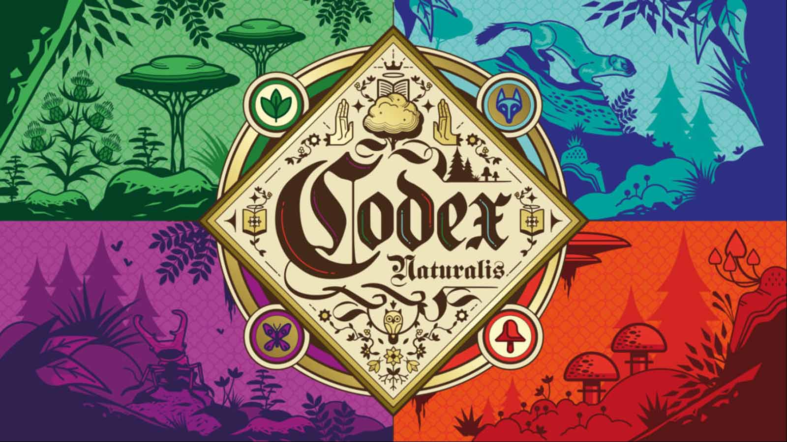

# Codex Naturalis
This project is a software implementation of the **Codex Naturalis** board game, developed as part of the Software Engineering final project for the academic year 2023-2024. It includes both simplified and complete rule sets, and was designed as a client-server application using the **Model-View-Controller** architecture.

## Application Features

The application incorporates the following key elements:

1. **Communication Protocols:**  
   Supports both **socket** and **RMI** protocols.

2. **User Interface:**  
   A fully functional **TUI (Textual User Interface)**.

3. **Advanced Functionalities:**  
   **Disconnection Resilience:** Players can seamlessly reconnect to ongoing games after a disconnection, with the game pausing if only one player remains connected.  
   **Concurrent Games:** A single server instance can manage multiple games simultaneously.

## Setup

- In the [Jar](CodexNaturalis/deliverables/jar) folder there are two jar files, one to set the Server up, and the
  other one to start the Client.
- The Server can be run with the following command:
    ```
    > java --enable-preview -jar Server.jar 
    ```
  This command must be followed by the desired hostname for the server as argument (usually the IP of the network
  interface), if you want to play with other devices in LAN.

- The Client can be run with the following commands:
    ```
  > chcp 65001
    ```
  to enable the UTF-8 charset on Windows, then:
    ```
    > java --enable-preview -jar Client.jar 
    ```
  The Server's IP to connect to can be specified during the execution.
  In case the emoji are not displayed correctly in the Windows PowerShell, we suggest to use the Command Prompt.

## Utilized Software

* [Draw.io]: Sequence diagram and UML.
* [IntelliJ]: IDE for the project.
* [Maven]: Package and dependency management.

## Licences

**Cranio Creations**: https://www.craniocreations.it/

**Politecnico di Milano**: https://www.polimi.it/

## Team

Amina El Kharouai [@AminaElKharouai](https://github.com/AminaElKharouai)<br>
Jihad Founoun [@jihadfounoun](https://github.com/jihadfounoun)<br>
Mattia Locatelli [@MattiaLocatelli](https://github.com/MattiaLocatelli)<br>
